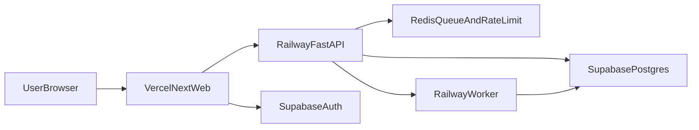
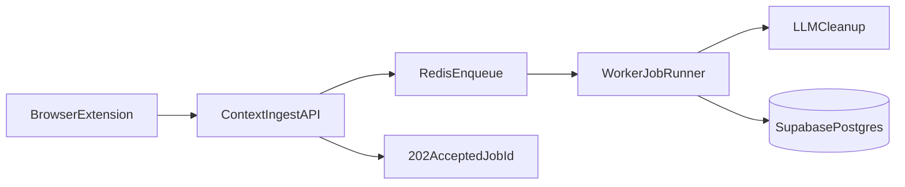
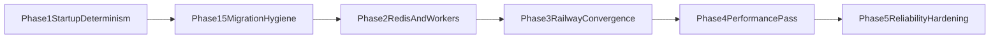

# Backend Architecture Hardening Plan (Vercel + Railway + Supabase)

## Goal

Harden the backend for production by removing startup bottlenecks, making deployment deterministic, and introducing scalable runtime controls (Redis-backed rate limiting + workers) while keeping the frontend on Vercel and backend on Railway.

## Target Architecture

## Current Risks to Fix First

- Startup performs DB initialization and seeding in request-serving runtime.
- Migration history has drift and needs cleanup before scaling.
- In-memory rate limiting is per-process and breaks under horizontal scale.
- Long-running processing still happens inline in request path.
- Deployment/runtime docs and CI behavior are not fully aligned with Railway-first backend hosting.

## Phase 1: Startup and Runtime Determinism

### Objectives

- Make app startup fast and side-effect free.
- Remove schema mutation/seeding from runtime boot.
- Enforce migrations as the only schema evolution path.

### Changes

- Update `OvalensPlanner/apps/api/app/main.py`:
  - Remove runtime calls to DB creation/seed/FTS initialization.
  - Keep startup limited to app wiring, logging, and monitoring setup.
- Update `OvalensPlanner/apps/api/app/db/engine.py`:
  - Remove runtime `create_all` style behavior from operational code paths.
- Update `OvalensPlanner/apps/api/app/db/seed.py` usage model:
  - Keep seed logic, but only callable via explicit dev command/script.
  - Add environment guard so seeding cannot run in production by mistake.

### Acceptance Criteria

- API boots without mutating schema or inserting demo data.
- Cold starts are materially lower and stable.
- Production runtime never executes seeding paths.

### Implemented (Phase 1)

- Startup in `app/main.py` no longer calls `init_db`, `seed_if_empty`, or `init_fts`; only logging and Sentry run at boot.
- `seed_if_empty` in `app/db/seed.py` is a no-op when `ENVIRONMENT` is `production` or `beta`.
- Manual dev seed script: `apps/api/scripts/seed_db.py` (run with `python scripts/seed_db.py` from `apps/api`; refuses to run in production/beta).
- **Production requirement:** run `alembic upgrade head` before starting the API so schema exists; do not rely on runtime table creation.

## Phase 1.5: Alembic and Schema Hygiene

### Objectives

- Normalize migration history before scaling.
- Add high-value indexes for hot query paths.

### Changes

- Reconcile migrations in:
  - `OvalensPlanner/apps/api/alembic/versions/003_conversations_client_id_nullable.py`
  - `OvalensPlanner/apps/api/alembic/versions/006_ensure_conversations_client_id_nullable.py`
- Add new migration for explicit indexes on high-frequency columns:
  - `clients.user_id`
  - `households.user_id`
  - `conversations.user_id`
  - `conversations.client_id`
  - `messages.conversation_id`
  - `tax_profiles(client_id, created_at)`
  - `meeting_notes(client_id, meeting_date)`

### Acceptance Criteria

- `alembic upgrade head` succeeds on clean and existing environments.
- No duplicate/ambiguous migration intent remains.
- Query latency improves on list/detail endpoints after indexes.

### Implemented (Phase 1.5)

- **Migration chain:** 006 left in place as idempotent Postgres safety net; docstring clarified. Chain: 001 → 002 → 003 → 006 → 007.
- **Alembic env:** `fileConfig` in `alembic/env.py` is now optional so migrations run when `alembic.ini` has no logging sections.
- **New migration 007_add_performance_indexes:** Adds indexes for:
  - `clients(user_id)`, `households(user_id)`, `conversations(user_id)`, `conversations(client_id)`, `messages(conversation_id)`, `tax_profiles(client_id, created_at)`, `meeting_notes(client_id, meeting_date)`.
  - PostgreSQL uses DESC on composite indexes for “latest first” queries; SQLite uses ascending (no DESC in SQLite index). All use `IF NOT EXISTS` for idempotency.

## Phase 2: Scalable Runtime Controls

### Objectives

- Make rate limiting consistent across instances.
- Move expensive processing out of synchronous request path.

### Changes

- Replace in-memory limiter in `OvalensPlanner/apps/api/app/core/ratelimit.py` with Redis-backed counters.
- Keep dependency contract stable in `OvalensPlanner/apps/api/app/dependencies.py` so route behavior is unchanged.
- Introduce worker queue for long-running tasks (context cleanup first).
- Refactor `OvalensPlanner/apps/api/app/routers/context.py`:
  - API returns `202 Accepted` + job id.
  - Worker processes LLM cleanup and persists final result.

### Context Ingest Flow

### Acceptance Criteria

- Rate limits are consistent across multiple API instances.
- Context ingest endpoint remains responsive under load.
- Worker retry/failure behavior is observable and bounded.

### Implemented (Phase 2)

- **Config:** `REDIS_URL` optional in `app/config.py`. When set, rate limiting and context ingest use Redis.
- **Rate limiter:** `app/core/ratelimit.py` uses Redis fixed-window counters when `REDIS_URL` is set; falls back to in-memory when unset or on Redis error (fail-open).
- **Queue:** `app/core/queue.py` — `push_context_ingest_job(snippet_id)`, `pop_context_ingest_job(timeout)` for list `context_ingest_queue`.
- **Context ingest service:** `app/services/context_ingest.py` — `programmatic_cleanup`, `clean_with_llm`, `run_cleanup_for_snippet(session, snippet_id)` (used by router and worker).
- **Context router:** When `REDIS_URL` set: create snippet with `status=processing`, enqueue snippet_id, return `202` with `job_id`. When Redis down, run cleanup synchronously and return 200. When `REDIS_URL` unset: synchronous flow unchanged (200 with body). New endpoint `GET /context/jobs/{job_id}` returns `{ job_id, status, snippet_id, created_at }` (scoped to current user).
- **Worker:** `scripts/context_ingest_worker.py` — async loop: `pop_context_ingest_job(timeout=5)`, then `run_cleanup_for_snippet(session, snippet_id)`. Requires `REDIS_URL` and `DATABASE_URL`.

## Phase 3: Deployment Convergence (Railway API)

### Objectives

- Standardize backend runtime to Railway.
- Ensure deploy pipeline runs migrations before traffic.

### Changes

- Add API deployment artifacts:
  - `Dockerfile` for API service
  - worker process command profile
- Configure Railway deploy sequence:
  - pre-deploy `alembic upgrade head`
  - then start API and worker services
- Align docs and CI with Railway-first API deployment:
  - `OvalensPlanner/docs/VERCEL_DEPLOYMENT.md`
  - `.github/workflows/ci.yml`

### Acceptance Criteria

- One clear backend deploy path (Railway).
- Migrations always run before application code serves traffic.
- No split-brain docs about API host platform.

### Implemented (Phase 3)

- **Dockerfile** at `OvalensPlanner/apps/api/Dockerfile`: Python 3.12-slim, install from `requirements.txt` (includes `psycopg2-binary` for Alembic), copy `app/`, `scripts/`, `alembic/`, `alembic.ini`. **CMD** runs `alembic upgrade head` then `uvicorn app.main:app --host 0.0.0.0 --port ${PORT}` so migrations run on every container start before traffic.
- **Worker:** Same image; override start command to `python scripts/context_ingest_worker.py` (documented in Railway guide).
- **Docs:** `OvalensPlanner/docs/RAILWAY_DEPLOYMENT.md` — Root Directory, env vars, optional Redis and worker. `VERCEL_DEPLOYMENT.md` updated to point to Railway as the recommended API host.

## Phase 4: Query and Endpoint Performance

### Objectives

- Remove obvious N+1 query patterns.
- Add safe pagination defaults for growth.

### Changes

- Optimize hotspot reads in:
  - `OvalensPlanner/apps/api/app/routers/clients.py`
  - `OvalensPlanner/apps/api/app/services/chat.py`
- Replace per-record lookup loops with batched queries/subqueries.
- Add pagination/caps for high-cardinality list endpoints.

### Acceptance Criteria

- Lower p95 latency on clients/chat retrieval endpoints.
- Query count reduced for household/client detail requests.

## Phase 5: Reliability, Observability, Security Hardening

### Objectives

- Add production guardrails around backend dependencies.
- Improve operational visibility and readiness semantics.

### Changes

- Extend health/readiness:
  - `OvalensPlanner/apps/api/app/routers/ready.py`
  - `OvalensPlanner/apps/api/app/routers/health.py`
  - include Redis dependency checks where relevant
- Expand metrics:
  - queue depth
  - job duration
  - job failures/retries
- Tighten production config in `OvalensPlanner/apps/api/app/config.py`:
  - strict CORS validation
  - trusted proxy safety checks

### Acceptance Criteria

- Readiness reflects real dependency health.
- Failure modes are measurable and alertable.
- Production config is explicit and safe-by-default.

## Testing and Release Gates

- Phase 1: startup smoke test proves no DB mutation/seed side effects.
- Phase 1.5: migration test against clean DB + migrated staging snapshot.
- Phase 2: Redis limiter integration tests + worker integration tests.
- Phase 3: CI stage validates migration execution in deployment flow.
- Phase 4: before/after benchmark on key endpoints.
- Phase 5: synthetic dependency-failure tests for readiness behavior.

## Rollout Strategy

- Roll out in canary order: schema compatibility -> API runtime changes -> worker activation -> endpoint cutovers.
- Use feature flags for async route transitions.
- Preserve backward compatibility during each phase to keep rollback simple.

## Implementation Order (Practical)

1. Remove runtime DB init/seed side effects.
2. Clean migration chain and add indexes.
3. Add Redis limiter.
4. Add worker queue and async context ingestion.
5. Standardize Railway deploy and migration pipeline.
6. Perform N+1 and pagination optimization pass.
7. Final hardening of health, metrics, and config rules.

